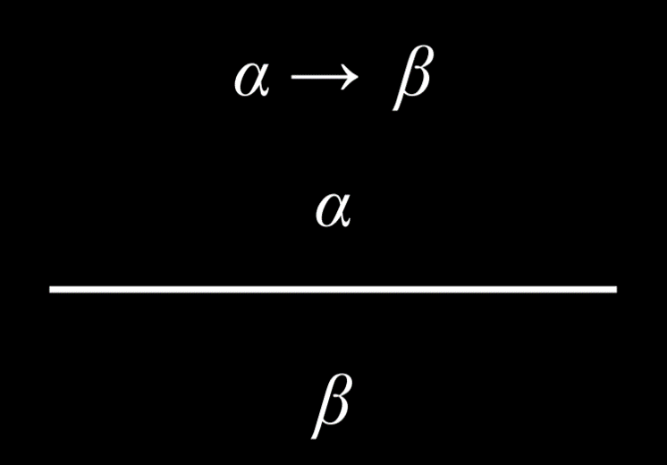
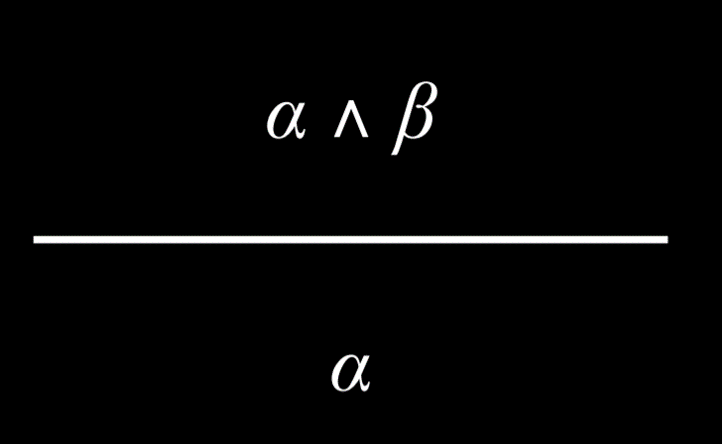
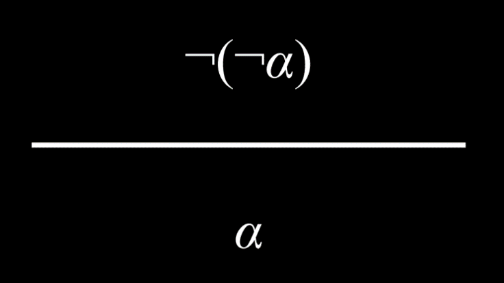
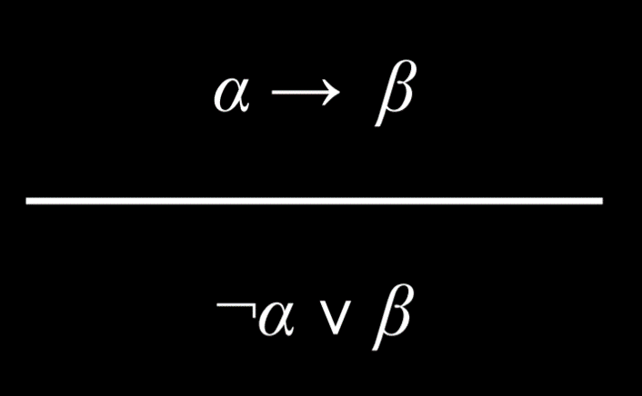
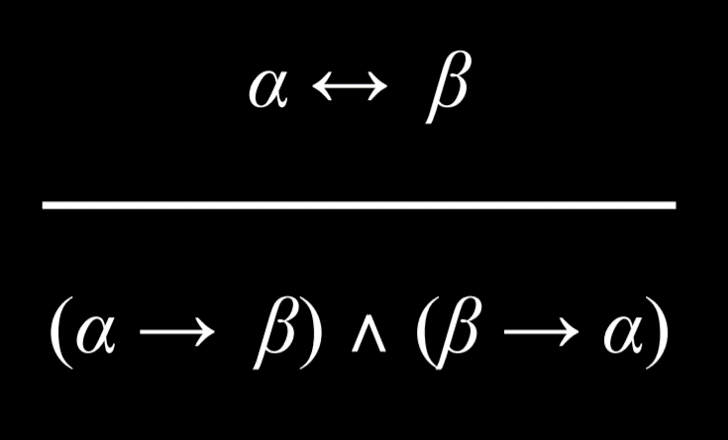
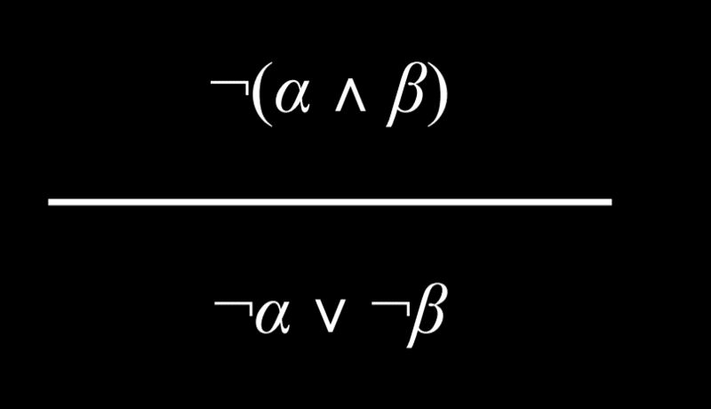
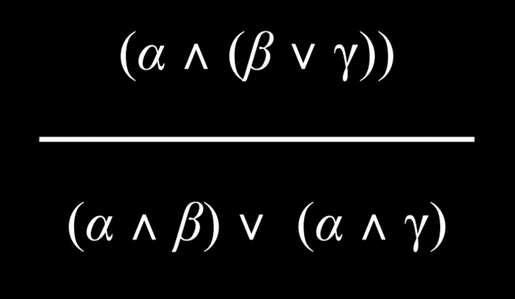

## Knowledge
Humans reason based on existing knowledge and draw conclusions from it. The concept of representing knowledge and drawing conclusions from it is also used in AI.

**Consider example:**
```
1. If it didn’t rain, Harry visited Hagrid today.
2. Harry visited Hagrid or Dumbledore today, but not both.
3. Harry visited Dumbledore today.
```

Based on these three sentences, we can answer the question “did it rain today?”, even though none of the individual sentences tells us anything about whether it is raining today. We know that Harry visited Dumbledore. We also know that Harry visited either Dumbledore or Hagrid, and thus we can conclude:

```
4. Harry did not visit Hagrid.
```

Now, looking at sentence 1, we understand that if it didn’t rain, Harry would have visited Hagrid. However, knowing sentence 4, we know that this is not the case. Therefore, we can conclude:

```
5. It rained today.
```

#### Terminology:
- **Knowledge-Based Agents** - Agent that reasons by operating on the internal representation of knowledge.
- **Sentence** - An assertion about the world in a knowledge representation language. A sentence is how AI stores knowledge and uses it to infer new information.
- **Propositional Symbols** - Most often letters (P, Q, R) are used to represent a proposition.

# Propositional Logic
Propositional logic is based on propositions, statements about the world that can be either **true** or **false**.

### Logical Connectives:
- **Not (¬)** inverses the truth value of the proposition. *Ex. if P: “It is raining,” then ¬P: “It is not raining”.*
- **And (∧)** connects two different propositions. When these two propositions, P and Q, are connected by ∧, the resulting proposition P ∧ Q is true only in the case that both P and Q are true.
- **Or (∨)** is true as long as either of its arguments is true. This means that for P ∨ Q to be true, at least one P or Q has to be true.
- **Implication (→)** represents a structure of “if P then Q.” *Ex. if P: “It is raining” and Q: “I’m indoors”, then P → Q means “If it is raining, then I’m indoors.” In the case of P implies Q (P → Q), P is called the antecedent, and Q is called the consequent.*
- **Biconditional (↔)** is an implication that goes both directions. You can read it as “if and only if.” P ↔ Q is the same as P → Q and Q → P has taken together. *Ex. if P: “It is raining.” and Q: “I’m indoors,” then P ↔ Q means that “If it is raining, then I’m indoors,” and “if I’m indoors, then it is raining.” This means that we can infer more than we could with a simple implication. If P is false, then Q is also false; if it is not raining, we know that I’m also not indoors.*

### Model
The model is an assignment of a truth value to every proposition. To reiterate, propositions are statements about the world that can be either true or false. However, knowledge about the world is represented in the truth values of these propositions. The model is the truth-value assignment that provides information about the world.

*For example, if P: “It is raining.” and Q: “It is Tuesday.”, a model could be the following truth-value assignment: {P = True, Q = False}. This model means that it is raining, but it is not Tuesday. However, there are more possible models in this situation (for example, {P = True, Q = True}, where it is both raining an a Tuesday). In fact, the number of possible models is 2 to the power of the number of propositions. In this case, we had 2 propositions, so 2²=4 possible models.*

### Knowledge Base (KB)
The knowledge base is a set of sentences known by a knowledge-based agent. This is the knowledge that the AI is provided about the world in the form of propositional logic sentences that can be used to make additional inferences about the world.

### Entailment (⊨)
If α ⊨ β (α entails β), then in any world where α is true, β is true, too.

*For example, if α: “It is a Tuesday in January” and β: “It is a Tuesday,” then we know that α ⊨ β. If it is true that it is a Tuesday in January, we also know that it is a Tuesday. Entailment is different from implication. The implication is a logical connection between two propositions. Entailment, on the other hand, is a relationship that means that if all the information in α is true, then all the information in β is true.*

## Inference
Inference is the process of deriving new sentences from old ones.

For instance, in the Harry Potter example earlier, sentences 4 and 5 were inferred from sentences 1, 2, and 3.

There are multiple ways to infer new knowledge based on existing knowledge. First, we will consider the **Model Checking algorithm**. To determine if KB ⊨ α (in other words, answering the question: “can we conclude that α is true based on our knowledge base”):
- Enumerate all possible models.
- If in every model where KB is true, α is true as well, then KB entails α (KB ⊨ α).

*For example, P: It is a Tuesday. Q: It is raining. R: Harry will go for a run. KB: (P ∧ ¬Q) → R (in words, P and not Q imply R) P (P is true) ¬Q (Q is false) Query: R (We want to know whether R is true or false; Does KB ⊨ R?)*

To answer the query using the Model Checking algorithm, we enumerate all possible models. Then, we go through every model and check whether it is true given our Knowledge Base. First, in our KB, we know that P is true. Thus, we can say that the KB is false in all models where P is not true. Next, similarly, in our KB, we know that Q is false. Thus, we can say that the KB is false in all models where Q is true. Finally, we are left with two models. In both, P is true and Q is false. In one model R is true and in the other R is false. Due to (P ∧ ¬Q) → R being in our KB, we know that in the case where P is true and Q is false, R must be true. Thus, we say that our KB is false for the model where R is false, and true for the model where R is true.

```
| P     | Q     | R     | KB    |
|-------|-------|-------|-------|
| false | false | false | false |
| false | false | true  | false |
| false | true  | false | false |
| false | true  | true  | false |
| true  | false | false | false |
| true  | false | true  | true  |
| true  | true  | false | false |
| true  | true  | true  | false |
```

Looking at this table, there is only one model where our knowledge base is true. In this model, we see that R is also true. By our definition of entailment, if R is true in all models where the KB is true, then KB ⊨ R.

### In Code...
```py
from logic import *

# Create new classes, each having a name, or a symbol, representing each proposition.
rain = Symbol("rain")  # It is raining.
hagrid = Symbol("hagrid")  # Harry visited Hagrid
dumbledore = Symbol("dumbledore")  # Harry visited Dumbledore

# Save sentences into the KB
knowledge = And(  # Starting from the "And" logical connective, becasue each proposition represents knowledge that we know to be true.

  Implication(Not(rain), hagrid),  # ¬(It is raining) → (Harry visited Hagrid)

  Or(hagrid, dumbledore),  # (Harry visited Hagrid) ∨ (Harry visited Dumbledore).

  Not(And(hagrid, dumbledore)),  # ¬(Harry visited Hagrid ∧ Harry visited Dumbledore) i.e. Harry did not visit both Hagrid and Dumbledore.

  dumbledore  # Harry visited Dumbledore. Note that while previous propositions contained multiple symbols with connectors, this is a proposition consisting of one symbol. This means that we take as a fact that, in this KB, Harry visited Dumbledore.
)
```

To run the Model Checking algorithm, the following information is needed:
- Knowledge Base, which will be used to draw inferences
- A query, or the proposition that we are interested in whether it is entailed by the KB
- Symbols, a list of all the symbols (or atomic propositions) used (in our case, these are `rain`, `hagrid`, and `dumbledore`)
- Model, an assignment of truth and false values to symbols

The model checking algorithm looks as follows:
```py
def check_all(knowledge, query, symbols, model):

  # If model has an assignment for each symbol
  # (The logic below might be a little confusing: we start with a list of symbols. The function is recursive, and every time it calls itself it pops one symbol from the symbols list and generates models from it. Thus, when the symbols list is empty, we know that we finished generating models with every possible truth assignment of symbols.)
  if not symbols:

    # If knowledge base is true in model, then query must also be true
    if knowledge.evaluate(model):
        return query.evaluate(model)
    return True
  else:

    # Choose one of the remaining unused symbols
    remaining = symbols.copy()
    p = remaining.pop()

    # Create a model where the symbol is true
    model_true = model.copy()
    model_true[p] = True

    # Create a model where the symbol is false
    model_false = mode.copy()
    model_false[p] = False

    # Ensure entailment holds in both models
    return(check_all(knowledge, query, remaining, model_true) and check_all(knowledge, query, remaining, model_false))
```

## Knowledge Engineering
Knowledge engineering is the process of figuring out how to represent propositions and logic in AI.

For example, lets take a game of Clue. In the game, a murder was committed by a person, using a tool in a location. *People*, *tools*, and *locations* are represented by cards. One card of each category is picked at random and put in an envelope, and it is up to the participants to uncover whodunnit. Participants do so by uncovering cards and deducing from these clues what must be in the envelope. We will use the Model Checking algorithm from before to uncover the mystery. In our model, we mark as True items that we know are related to the murder and False otherwise.

We can start creating our knowledge base by adding the rules of the game. We know for certain that one person is the murderer, that one tool was used, and that the murder happened in one location. This can be represented in propositional logic the following way:

```py
# Start with the game conditions: one item in each of the three categories has to be true.
Or(mustard, plum, scarlet),
Or(ballroom, kitchen, library),
Or(knife, revolver, wrench),
```

The game starts with each player seeing one person, one tool, and one location, thus knowing that they are not related to the murder:

```py
# Add the information from the three initial cards we saw
Not(mustard),
Not(kitchen),
Not(revolver),
```

In other situations in the game, one can make a guess, suggesting one combination of person, tool and location. Suppose that the guess is that Scarlet used a wrench to commit the crime in the library. If this guess is wrong, then the following can be deduced and added to the KB:

```py
# Add the guess someone made that it is Scarlet, who used a wrench in the library
Or(Not(scarlet), Not(library), Not(wrench)),
```

Now, suppose someone shows us the Plum card. Thus, we can add Plum to our KB. At this point, we can conclude that the murderer is Scarlet. Adding just one more piece of knowledge, for example, that it is not the ballroom, can give us more information.

```py
# Add the cards that we were exposed to
Not(plum),
Not(ballroom)
```

And now, using multiple previous pieces of data, we can deduce that Scarlet committed the murder with a knife in the library.

```py
# Add the clues to the KB
knowledge = And(

  # Start with the game conditions: one item in each of the three categories has to be true.
  Or(mustard, plum, scarlet),
  Or(ballroom, kitchen, library),
  Or(knife, revolver, wrench),

  # Add the information from the three initial cards we saw
  Not(mustard),
  Not(kitchen),
  Not(revolver),

  # Add the guess someone made that it is Scarlet, who used a wrench in the library
  Or(Not(scarlet), Not(library), Not(wrench)),

  # Add the cards that we were exposed to
  Not(plum),
  Not(ballroom)
)
```

## Inference Rules
Model Checking is not an efficient algorithm. It is not efficient because it has to consider every possible model before giving the answer.

**Inference rules** on the other hand allow us to generate new information based on existing knowledge without considering every possible model.

Inference rules are usually represented using a horizontal bar that separates the top part, the premise, from the bottom part, the conclusion. The premise is whatever knowledge we have, and the conclusion is what knowledge can be generated based on the premise.

```
If it is raining, then Harry is inside.
It is raining.
_______________________________________
Harry is inside.
```

There are different types of inference rules:
- **Modus Ponens** - if we know an implication and its antecedent to be true, then the consequent is true as well.
    * 
- **And Elimination** - If an And proposition is true, then any one atomic proposition within it is true as well. *For example, if we know that Harry is friends with Ron and Hermione, we can conclude that Harry is friends with Hermione.*
    * 
- **Double Negation Elimination** - A proposition that is negated twice is true. *For example, consider the proposition “It is not true that Harry did not pass the test”. We can parse it the following way: “It is not true that (Harry did not pass the test)”, or “¬(Harry did not pass the test)”, and, finally “¬(¬(Harry passed the test)).” The two negations cancel each other, marking the proposition “Harry passed the test” as true.*
    * 
- **Implication Elimination** - An implication is equivalent to an Or relation between the negated antecedent and the consequent. *(As an example, the proposition “If it is raining, Harry is inside” is equivalent to the proposition “(it is not raining) or (Harry is inside).”)*
    * 
- **Biconditional Elimination** - A biconditional proposition is equivalent to an implication and its inverse with an And connective. *For example, “It is raining if and only if Harry is inside” is equivalent to (“If it is raining, Harry is inside” And “If Harry is inside, it is raining”).*
    * 
- **De Morgan’s Law** - It is possible to turn an And connective into an Or connective. *Consider the following proposition: “It is not true that both Harry and Ron passed the test.” From this, it is possible to conclude that “It is not true that Harry passed the test” Or “It is not true that Ron passed the test.” That is, for the And proposition earlier to be true, at least one of the propositions in the Or propositions must be true.*
    * 
- **Distributive Property** - A proposition with two elements that are grouped with And or Or connectives can be distributed, or broken down into, smaller units consisting of And and Or.
    * 

### Knowledge and Search Problems
Considering the inference rules (actions) -> Inference can be viewed as a search problem with the following properties:
- **Initial state**: starting knowledge base
- **Actions**: inference rules
- **Transition model**: new knowledge base after inference
- **Goal test**: checking whether the statement that we are trying to prove is in the KB
- **Path cost function**: the number of steps in the proof

This shows just how versatile search algorithms are, allowing us to derive new information based on existing knowledge using inference rules.

## Resolution
Resolution is a powerful inference rule that states that if one of two atomic propositions in an Or proposition is false, the other has to be true.

*For example, given the proposition “Ron is in the Great Hall” Or “Hermione is in the library”, in addition to the proposition “Ron is not in the Great Hall,” we can conclude that “Hermione is in the library.”*

Resolution relies on **Complementary Literals**, two of the same atomic propositions where one is negated and the other is not, such as P and ¬P. Complementary literals allow us to generate new sentences through inferences by resolution. Thus, inference algorithms locate complementary literals to generate new knowledge.

A **Clause** is a disjunction of literals (a propositional symbol or a negation of a propositional symbol, such as P, ¬P). A **disjunction** consists of propositions that are connected with an Or logical connective (P ∨ Q ∨ R). A **conjunction**, on the other hand, consists of propositions that are connected with an And logical connective (P ∧ Q ∧ R). Clauses allow us to convert any logical statement into a **Conjunctive Normal Form (CNF)**, which is a conjunction of clauses, for example: (A ∨ B ∨ C) ∧ (D ∨ ¬E) ∧ (F ∨ G).

ELI5: By doing this conversion of propositions we are essentially changing the form of the propositions to generate new information. This is very useful in the next step of "proof by contradiction" where to determine if KB ⊨ α (True) we actually assume that (KB ∧ ¬α) (that it is False). It's like reverse trying to figure out a logical problem.

### Proof by Contradiction
Proof by contradiction is a tool used often in computer science. If our knowledge base is true, and it contradicts ¬α, it means that ¬α is false, and, therefore, α must be true. More technically, the algorithm would perform the following actions To determine if KB ⊨ α:
- Convert (KB ∧ ¬α) to Conjunctive Normal Form.
- Keep checking to see if we can use resolution to produce a new clause.
- If we ever produce the empty clause (equivalent to False), congratulations! We have arrived at a contradiction, thus proving that KB ⊨ α.
- However, if contradiction is not achieved and no more clauses can be inferred, there is no entailment.

# First Order Logic
First order logic is another type of logic that allows us to express more complex ideas more succinctly than propositional logic.

First order logic uses two types of symbols:
- Constant Symbols - represent objects.
- Predicate Symbols - represent relations or functions that take an argument and return a true or false value.

For example, we return to the logic puzzle with different people and house assignments at Hogwarts.

*The constant symbols are people or houses, like Minerva, Pomona, Gryffindor, Hufflepuff, etc. The predicate symbols are properties that hold true or false of some constant symbols. For example, we can express the idea that Minerva is a person using the sentence Person(Minerva). Similarly, we can express the idea the Gryffindor is a house using the sentence House(Gryffindor). All the logical connectives work in first order logic the same way as before. For example, ¬House(Minerva) expresses the idea that Minerva is not a house. A predicate symbol can also take two or more arguments and express a relation between them. For example, BelongsTo expresses a relation between two arguments, the person and the house to which the person belongs. Thus, the idea that Minerva belongs to Gryffindor can be expressed as BelongsTo(Minerva, Gryffindor). First order logic allows having one symbol for each person and one symbol for each house.*

This is more succinct than propositional logic, where each person—house assignment would require a different symbol.

## Universal Quantification
Quantification is a tool that can be used in first order logic to represent sentences without using a specific constant symbol.

Universal quantification uses the symbol ∀ to express “for all.” *So, for example, the sentence ∀x. BelongsTo(x, Gryffindor) → ¬BelongsTo(x, Hufflepuff) expresses the idea that it is true for every symbol that if this symbol belongs to Gryffindor, it does not belong to Hufflepuff.*

## Existential Quantification
Existential quantification is an idea parallel to universal quantification. However, while universal quantification was used to create sentences that are true for all x, existential quantification is used to create sentences that are true for at least one x.

It is expressed using the symbol ∃. *For example, the sentence ∃x. House(x) ∧ BelongsTo(Minerva, x) means that there is at least one symbol that is both a house and that Minerva belongs to it. In other words, this expresses the idea that Minerva belongs to a house.*

Existential and universal quantification can be used in the same sentence. *For example, the sentence ∀x. Person(x) → (∃y. House(y) ∧ BelongsTo(x, y)) expresses the idea that if x is a person, then there is at least one house, y, to which this person belongs. In other words, this sentence means that every person belongs to a house.*

There are other types of logic as well, and the commonality between them is that they all exist in pursuit of representing information. These are the systems we use to represent knowledge in our AI.