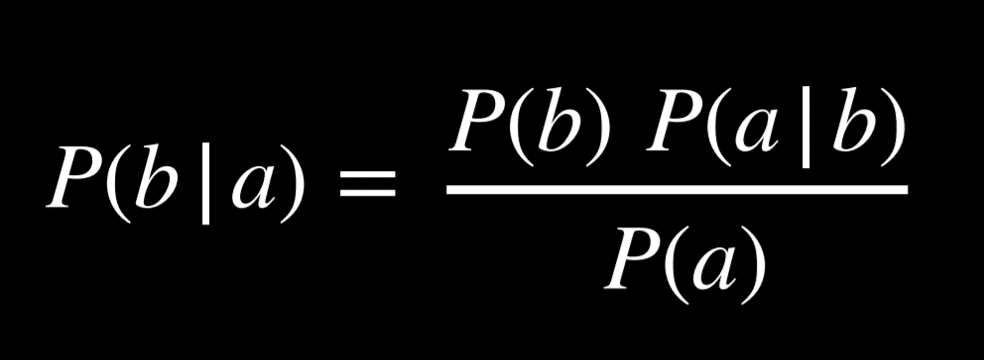

# Uncertainty
In reality, the AI has only partial knowledge of the world, leaving space for uncertainty.

Still, we would like our AI to make the best possible decision in these situations. For example, when predicting weather, the AI has information about the weather today, but there is no way to predict with 100% accuracy the weather tomorrow. Still, we can do better than chance. So we are interested that our AI that makes optimal decisions given limited information and uncertainty.

# Probability
Uncertainty can be represented as a number of events and the likelihood, or probability, of each of them happening.

Every possible situation can be thought of as a world, represented by the lowercase Greek letter omega ω. For example, rolling a die can result in six possible worlds: a world where the die yields a 1, a world where the die yields a 2, and so on. To represent the probability of a certain world, we write P(ω).

0 < P(ω) < 1: every value representing probability must range between 0 and 1. The probabilities of every possible event, when summed together, are equal to 1.


## Unconditional Probability
Unconditional probability is the degree of belief in a proposition in the absence of any other evidence. All the questions that we have asked so far were questions of unconditional probability, because the result of rolling a die is not dependent on previous events.

## Conditional Probability
Conditional probability is the degree of belief in a proposition given some evidence that has already been revealed. As discussed in the introduction, AI can use partial information to make educated guesses about the future. To use this information, which affects the probability that the event occurs in the future, we rely on conditional probability.

Conditional probability is expressed using the following notation: P(a | b), meaning “the probability of event a occurring given that we know event b to have occurred,” or, more succinctly, “the probability of a given b.”

*Now we can ask questions like what is the probability of rain today given that it rained yesterday P(rain today | rain yesterday), or what is the probability of the patient having the disease given their test results P(disease | test results).*

Mathematically, to compute the conditional probability of a given b, we use the following formula:


To put it in words, the probability that a given b is true is equal to the probability of a and b being true, divided by the probability of b. An intuitive way of reasoning about this is the thought “we are interested in the events where both a and b are true (the numerator), but only from the worlds where we know b to be true (the denominator).” Dividing by b restricts the possible worlds to the ones where b is true. 

## Random Variables
A random variable is a variable in probability theory with a domain of possible values that it can take on. For example, to represent possible outcomes when rolling a die, we can define a random variable Roll, that can take on the values *{0, 1, 2, 3, 4, 5, 6}*. To represent the status of a flight, we can define a variable Flight that takes on the values *{on time, delayed, canceled}*.

Often, we are interested in the probability with which each value occurs. We represent this using a probability distribution. For example *P(Flight) = <0.6, 0.3, 0.1>*

### Independence
Independence is the knowledge that the occurrence of one event does not affect the probability of the other event. For example, when rolling two dice, the result of each die is independent from the other. *Rolling a 4 with the first die does not influence the value of the second die that we roll.* This is opposed to dependent events, like clouds in the morning and rain in the afternoon. *If it is cloudy in the morning, it is more likely that it will rain in the morning, so these events are dependent.*

## Bayes’ Rule
Bayes’ rule is commonly used in probability theory to compute conditional probability. In words, Bayes’ rule says that the probability of b given a is equal to the probability of a given b, times the probability of b, divided by the probability of a.



For example, we would like to compute the probability of it raining in the afternoon if there are clouds in the morning, or P(rain | clouds). We start with the following information:
- 80% of rainy afternoons start with cloudy mornings, or P(clouds | rain).
- 40% of days have cloudy mornings, or P(clouds).
- 10% of days have rainy afternoons, or P(rain).

Applying Bayes’ rule, we compute (0.1)(0.8)/(0.4) = 0.2. That is, the probability that it rains in the afternoon given that it was cloudy in the morning is 20%.

## Joint Probability
Joint probability is the likelihood of multiple events all occurring.

Let us consider the following example, concerning the probabilities of clouds in the morning and rain in the afternoon.

C = cloud = 0.4; C = ¬cloud = 0.6
R = rain = 0.1; R = ¬rain = 0.9

Looking at these data, we can’t say whether clouds in the morning are related to the likelihood of rain in the afternoon. To be able to do so, we need to look at the joint probabilities of all the possible outcomes of the two variables. We can represent this in a table as follows:

```
|             | R Rain | R not Rain |
|-------------|--------|------------|
| C Cloud     | 0.08   | 0.32       |
| C not Cloud | 0.02   | 0.58       |
```

Now we are able to know information about the co-occurrence of the events. For example, we know that the probability of a certain day having clouds in the morning and rain in the afternoon is 0.08. The probability of no clouds in the morning and no rain in the afternoon is 0.58.

## Probability Rules
- **Negation:** P(¬a) = 1 - P(a). This stems from the fact that the sum of the probabilities of all the possible worlds is 1, and the complementary literals a and ¬a include all the possible worlds.
- **Inclusion-Exclusion:** P(a ∨ b) = P(a) + P(b) - P(a ∧ b). This can interpreted in the following way: the worlds in which a or b are true are equal to all the worlds where a is true, plus the worlds where b is true. However, in this case, some worlds are counted twice (the worlds where both a and b are true)). To get rid of this overlap, we subtract once the worlds where both a and b are true (since they were counted twice).
- **Marginalization:** P(a) = P(a, b) + P(a, ¬b). The idea here is that b and ¬b are disjoint probabilities. That is, the probability of b and ¬b occurring at the same time is 0. We also know b and ¬b sum up to 1. Thus, when a happens, b can either happen or not. When we take the probability of both a and b happening in addition to the probability of a and ¬b, we end up with simply the probability of a
- **Conditioning:** P(a) = P(a | b)P(b) + P(a | ¬b)P(¬b). This is a similar idea to marginalization. The probability of event a occurring is equal to the probability of a given b times the probability of b, plus the probability of a given ¬b time the probability of ¬b.