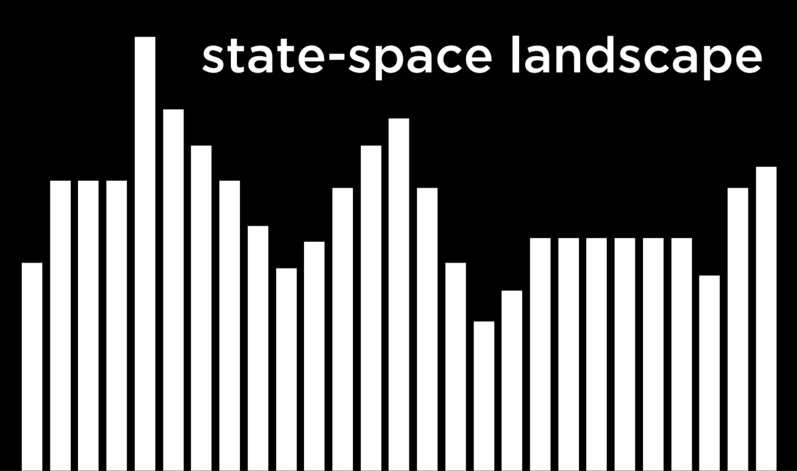
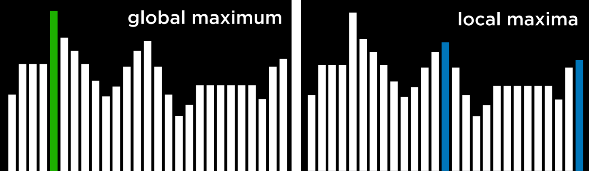
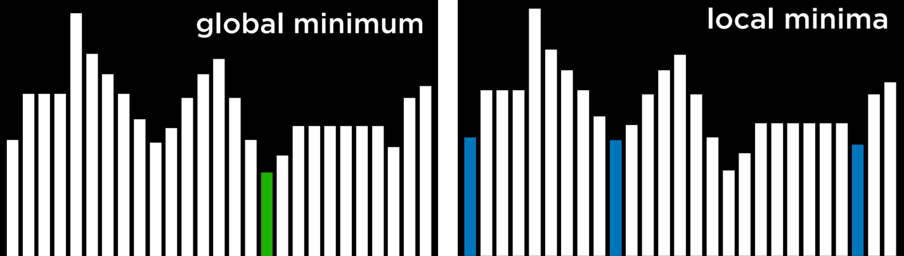
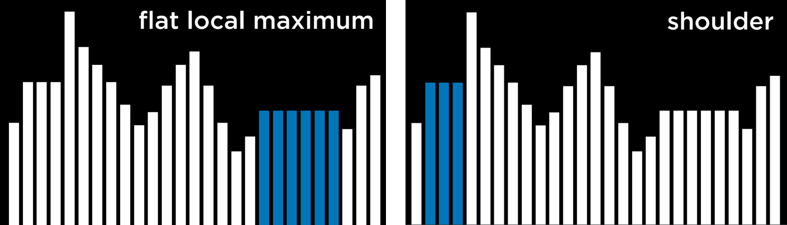

# Optimization
Optimization is choosing the best option from a set of possible options. 

## Local Search
Local search is a search algorithm that maintains a single node and searches by moving to a neighboring node. 

This type of algorithm is different from previous types of search that we saw. Whereas in maze solving, for example, we wanted to find the quickest way to the goal, local search is interested in finding the best answer to a question. Often, local search will bring to an answer that is not optimal but “good enough,” conserving computational power.

*Consider the following example of a local search problem: we have four houses in set locations. We want to build two hospitals, such that we minimize the distance from each house to a hospital. The distance between them is measured using Manhattan distance (number of moves up, down, and to the sides; discussed in more detail in lecture 0), and the sum of the distances from each house to the nearest hospital is 17. We call this the cost, because we try to minimize this distance. In this case, a state would be any one configuration of houses and hospitals.*

Abstracting this concept, we can represent each configuration of houses and hospitals as the state-space landscape below. Each of the bars in the picture represents a value of a state, which in our example would be the cost of a certain configuration of houses and hospitals.



Going off of this visualization, we can define a few important terms for the rest of our discussion:
- An **Objective Function** is a function that we use to maximize the value of the solution.
- A **Cost Function** is a function that we use to minimize the cost of the solution (this is the function that we would use in our example with houses and hospitals. We want to minimize the distance from houses to hospitals).
- A **Current State** is the state that is currently being considered by the function.
- A **Neighbor State** is a state that the current state can transition to. In the one-dimensional state-space landscape above, a neighbor state is the state to either side of the current state. In our example, a neighbor state could be the state resulting from moving one of the hospitals to any direction by one step. Neighbor states are usually similar to the current state, and, therefore, their values are close to the value of the current state.

Note that the way local search algorithms work is by considering one node in a current state, and then moving the node to one of the current state’s neighbors. This is unlike the minimax algorithm, for example, where every single state in the state space was considered recursively.

### Hill Climbing
Hill climbing is one type of a local search algorithm.

In this algorithm, the neighbor states are compared to the current state, and if any of them is better, we change the current node from the current state to that neighbor state. What qualifies as better is defined by whether we use an objective function, preferring a higher value, or a decreasing function, preferring a lower value.

A hill climbing algorithm will look the following way in pseudocode:
```
current = initial state of problem
repeat:
    neighbor = best valued neighbor of current
    if neighbor not better than current:
        return current
    current = neighbor
```

#### Local and Global Minima and Maxima
Hill climbing algorithm can get stuck in local maxima or minima.

A **local maximum** (plural: maxima) is a state that has a higher value than its neighboring states. As opposed to that, a **global maximum** is a state that has the highest value of all states in the state-space.



In contrast, a **local minimum** (plural: minima) is a state that has a lower value than its neighboring states. As opposed to that, a **global minimum** is a state that has the lowest value of all states in the state-space.



The problem with hill climbing algorithms is that they may end up in local minima and maxima. Once the algorithm reaches a point whose neighbors are worse, for the function’s purpose, than the current state, the algorithm stops.

Special types of local maxima and minima include the **flat local maximum/minimum**, where multiple states of equal value are adjacent, forming a plateau whose neighbors have a worse value, and the **shoulder**, where multiple states of equal value are adjacent and the neighbors of the plateau can be both better and worse. Starting from the middle of the plateau, the algorithm will not be able to advance in any direction.



#### Hill Climbing Variants
Due to the limitations of Hill Climbing, multiple variants have been thought of to overcome the problem of being stuck in local minima and maxima.

- **Steepest-ascent:** choose the highest-valued neighbor. This is the standard variation that we discussed above.
- **Stochastic:** choose randomly from higher-valued neighbors. Doing this, we choose to go to any direction that improves over our value. This makes sense if, for example, the highest-valued neighbor leads to a local maximum while another neighbor leads to a global maximum.
- **First-choice:** choose the first higher-valued neighbor.
- **Random-restart:** conduct hill climbing multiple times. Each time, start from a random state. Compare the maxima from every trial, and choose the highest amongst those.
- **Local Beam Search:** chooses the k highest-valued neighbors. This is unlike most local search algorithms in that it uses multiple nodes for the search, and not just one.

What all variations of the algorithm have in common is that, no matter the strategy, each one still has the potential of ending up in local minima and maxima and no means to continue optimizing. Although local search algorithms don’t always give the best possible solution, they can often give a good enough solution in situations where considering every possible state is computationally infeasible.
