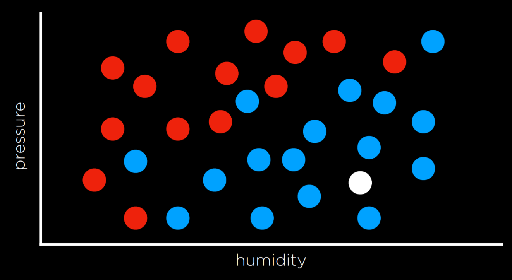
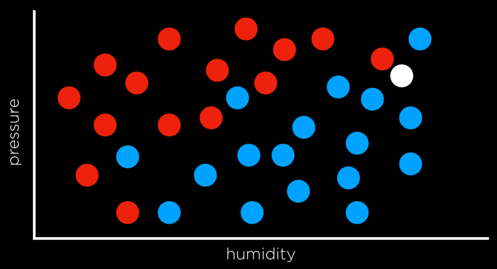
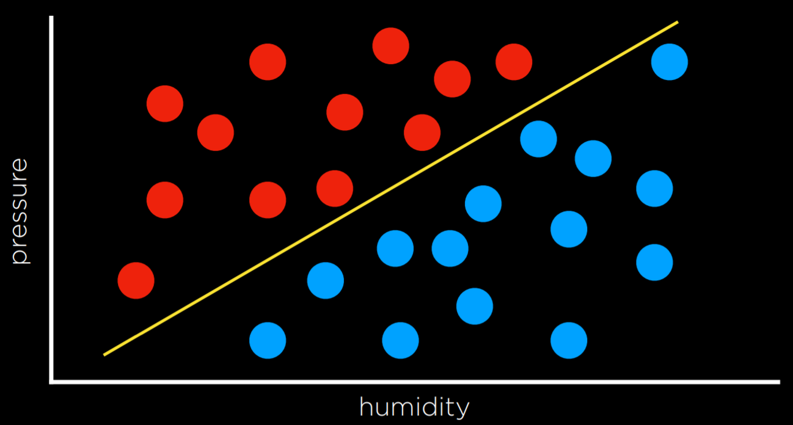
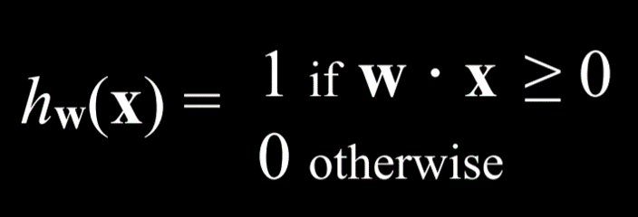
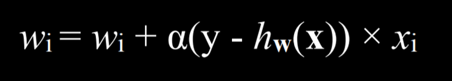
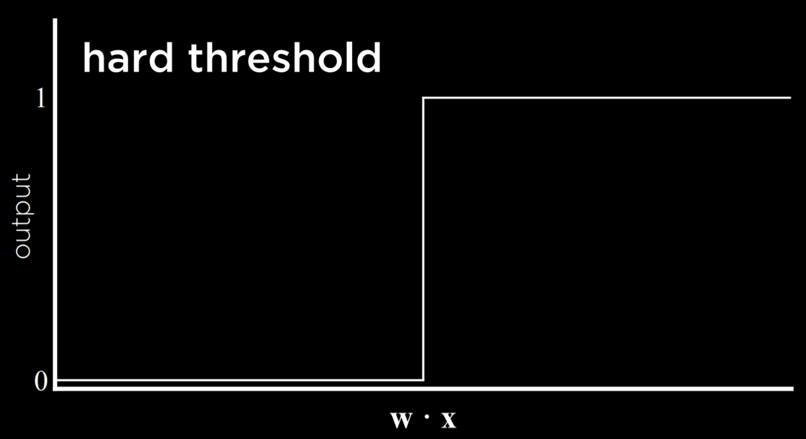
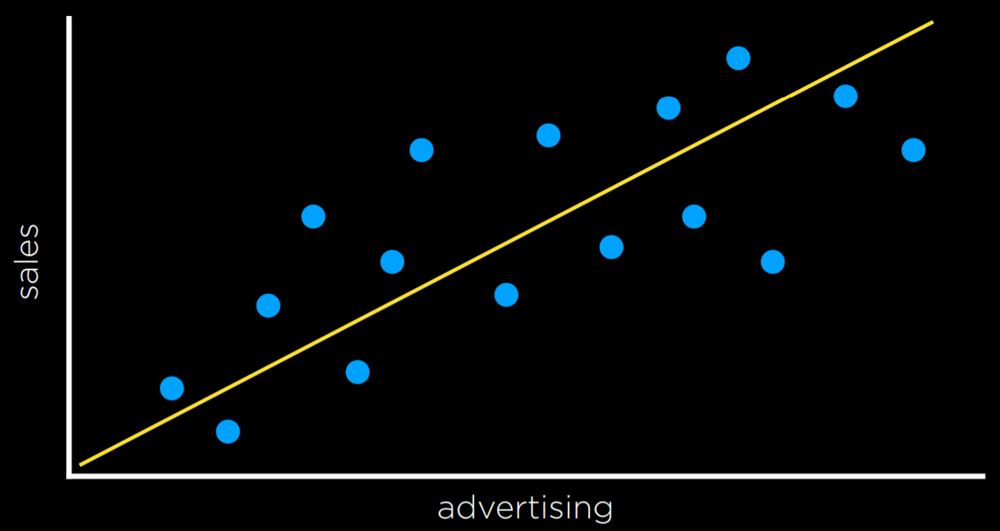
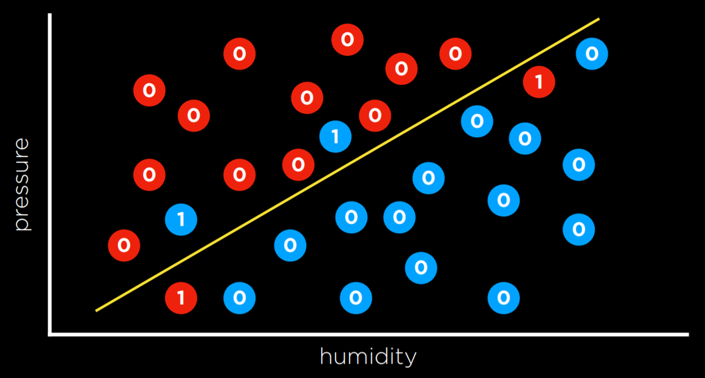
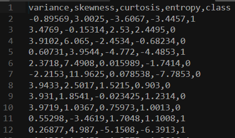

# Machine Learning
Machine learning provides a computer with data, rather than explicit instructions. Using these data, the computer learns to recognize patterns and becomes able to execute tasks on its own.

## Supervised Learning
Supervised learning is a task where a computer learns a function that maps inputs to outputs based on a dataset of input-output pairs.

There are multiple tasks under supervised learning, and one of those is **Classification**. 

This is a task where the function maps an input to a discrete output. *For example, given some information on humidity and air pressure for a particular day (input), the computer decides whether it will rain that day or not (output). The computer does this after training on a dataset with multiple days where humidity and air pressure are already mapped to whether it rained or not.*

This task can be formalized as follows. We observe nature, where a function *f(humidity, pressure)* maps the input to a discrete value, either Rain or No Rain. This function is hidden from us, and it is probably affected by many other variables that we don’t have access to. Our goal is to create function *h(humidity, pressure)* that can approximate the behavior of function *f*. Such a task can be visualized by plotting days on the dimensions of humidity and rain (the input), coloring each data point in blue if it rained that day and in red if it didn’t rain that day (the output). The white data point has only the input, and the computer needs to figure out the output.



### Nearest-Neighbor Classification
One way of solving a task like the one described above is by assigning the variable in question the value of the closest observation. *So, for example, the white dot on the graph above would be colored blue, because the nearest observed dot is blue as well. This might work well some times, but consider the graph below.*



*Following the same strategy, the white dot should be colored red, because the nearest observation to it is red as well. However, looking at the bigger picture, it looks like most of the other observations around it are blue, which might give us the intuition that blue is a better prediction in this case, even though the closest observation is red.*

One way to get around the limitations of nearest-neighbor classification is by using **k-nearest-neighbors classification**, where the dot is colored based on the most frequent color of the k nearest neighbors. It is up to the programmer to decide what k is. *Using a 3-nearest neighbors classification, for example, the white dot above will be colored blue, which intuitively seems like a better decision.*

A drawback of the k-nearest-neighbors classification is that, using a naive approach, the algorithm will have to measure the distance of every single point to the point in question, which is computationally expensive. This can be sped up by using data structures that enable finding neighbors more quickly or by pruning irrelevant observation.

### Perceptron Learning
Another way of going about a classification problem, as opposed to the nearest-neighbor strategy, is looking at the data as a whole and trying to create a decision boundary. In two-dimensional data, we can draw a line between the two types of observations. Every additional data point will be classified based on the side of the line on which it is plotted.



The drawback to this approach is that data are messy, and it is rare that one can draw a line and neatly divide the classes into two observations without any mistakes. Often, we will compromise, drawing a boundary that separates the observations correctly more often than not, but still occasionally misclassifies them.

In this case, the input of:
- x₁ = Humidity
- x₂ = Pressure

Will be given to a hypothesis function *h(x₁, x₂)*, which will output its prediction of whether it is going to rain that day or not. It will do so by checking on which side of the decision boundary the observation falls. Formally, the function will weight each of the inputs with an addition of a constant, ending in a linear equation of the following form:
- Rain w₀ + w₁x₁ + w₂x₂ ≥ 0
- No Rain otherwise

Often, the output variable will be coded as 1 and 0, where if the equation yields more than 0, the output is 1 (Rain), and 0 otherwise (No Rain).

The weights and values are represented by vectors, which are sequences of numbers (which can be stored in lists or tuples in Python). We produce a Weight Vector w: (w₀, w₁, w₂), and getting to the best weight vector is the goal of the machine learning algorithm. We also produce an Input Vector x: (1, x₁, x₂).

We take the dot product of the two vectors. That is, we multiply each value in one vector by the corresponding value in the second vector, arriving at the expression above: w₀ + w₁x₁ + w₂x₂. The first value in the input vector is 1 because, when multiplied by the weight vector w₀, we want to keep it a constant.

Thus, we can represent our hypothesis function the following way:



Since the goal of the algorithm is to find the best weight vector, when the algorithm encounters new data it updates the current weights. It does so using the perceptron learning rule:



The important takeaway from this rule is that for each data point, we adjust the weights to make our function more accurate. The details, which are not as critical to our point, are that each weight is set to be equal to itself plus some value value in parentheses. Here, y stands for the observed value while the hypothesis function stands for the estimate. If they are identical, this whole term is equal to zero, and thus the weight is not changed. If we underestimated (calling No Rain while Rain was observed), then the value in the parentheses will be 1 and the weight will increase by the value of xᵢ scaled by α the learning coefficient. If we overestimated (calling Rain while No Rain was observed), then the value in the parentheses will be -1 and the weight will decrease by the value of x scaled by α. The higher α, the stronger the influence each new event has on the weight.

The result of this process is a threshold function that switches from 0 to 1 once the estimated value crosses some threshold.



The problem with this type of function is that it is unable to express uncertainty, since it can only be equal to 0 or to 1. It employs a **hard threshold**. A way to go around this is by using a logistic function, which employs a **soft threshold**. A logistic function can yield a real number between 0 and 1, which will express confidence in the estimate. The closer the value to 1, the more likely it is to rain.


### Support Vector Machines
In addition to nearest-neighbor and linear regression, another approach to classification is the Support Vector Machine. This approach uses an additional vector (support vector) near the decision boundary to make the best decision when separating the data. Consider the example below.


All the decision boundaries work in that they separate the data without any mistakes. However, are they equally as good? The two leftmost decision boundaries are very close to some of the observations. This means that a new data point that differs only slightly from one group can be wrongly classified as the other. As opposed to that, the rightmost decision boundary keeps the most distance from each of the groups, thus giving the most leeway for variation within it. This type of boundary, which is as far as possible from the two groups it separates, is called the **Maximum Margin Separator**.

Another benefit of support vector machines is that they can represent decision boundaries with more than two dimensions, as well as non-linear decision boundaries, such as below.


To summarize, there are multiple ways to go about classification problems, with no one being always better than the other. Each has their drawbacks and might prove more useful than others in specific situations.

### Regression
Regression is a supervised learning task of a function that maps an input point to a continuous value, some real number. This differs from classification in that classification problems map an input to discrete values (Rain or No Rain).

*For example, a company might use regression to answer the question of how money spent advertising predicts money earned in sales. In this case, an observed function f(advertising) represents the observed income following some money that was spent in advertising (note that the function can take more than one input variable). These are the data that we start with. With this data, we want to come up with a hypothesis function h(advertising) that will try to approximate the behavior of function f. h will generate a line whose goal is not to separate between types of observations, but to predict, based on the input, what will be the value of the output.*



#### Loss Functions
Loss functions are a way to quantify the utility lost by any of the decision rules above. The less accurate the prediction, the larger the loss.

For classification problems, we can use a 0-1 Loss Function.
```
L(actual, predicted):
    0 if actual = predicted
    1 otherwise
```

n words, this function gains value when the prediction isn’t correct and doesn’t gain value when it is correct (i.e. when the observed and predicted values match).



In the example above, the days that are valued at 0 are the ones where we predicted the weather correctly (rainy days are below the line and not rainy days are above the line). However, days when it didn’t rain below the line and days when it did rain above it are the ones that we failed to predict. We give each one the value of 1 and sum them up to get an empirical estimate of how lossy our decision boundary is.

L₁ and L₂ loss functions can be used when predicting a continuous value. In this case, we are interested in quantifying for each prediction how much it differed from the observed value. We do this by taking either the absolute value or the squared value of the observed value minus the predicted value (i.e. how far the prediction was from the observed value).

- L₁: L(actual, predicted) = |actual - predicted|
- L₂: L(actual, predicted) = (actual - predicted)²

One can choose the loss function that serves their goals best. L₂ penalizes outliers more harshly than L₁ because it squares the the difference. L₁ can be visualized by summing the distances from each observed point to the predicted point on the regression line:


#### Overfitting
Overfitting is when a model fits the training data so well that it fails to generalize to other data sets. In this sense, loss functions are a double edged sword. In the two examples below, the loss function is minimized such that the loss is equal to 0. However, it is unlikely that it will fit new data well.


For example, in the left graph, a dot next to the red one at the bottom of the screen is likely to be Rain (blue). However, with the overfitted model, it will be classified as No Rain (red).

#### Regularization
Regularization is the process of penalizing hypotheses that are more complex to favor simpler, more general hypotheses. We use regularization to avoid overfitting.

In regularization, we estimate the cost of the hypothesis function h by adding up its loss and a measure of its complexity.

*cost(h) = loss(h) + λcomplexity(h)*

Lambda (λ) is a constant that we can use to modulate how strongly to penalize for complexity in our cost function. The higher λ is, the more costly complexity is.

One way to test whether we overfitted the model is with **Holdout Cross Validation**. In this technique, we split all the data in two: a **training set** and a **test set**. We run the learning algorithm on the training set, and then see how well it predicts the data in the test set. The idea here is that by testing on data that were not used in training, we can a measure how well the learning generalizes.

The downside of holdout cross validation is that we don’t get to train the model on half the data, since it is used for evaluation purposes. A way to deal with this is using **k-Fold Cross-Validation**. In this process, we divide the data into k sets. We run the training k times, each time leaving out one dataset and using it as a test set. We end up with k different evaluations of our model, which we can average and get an estimate of how our model generalizes without losing any data.

#### `scikit-learn`
As often is the case with Python, there are multiple libraries that allow us to conveniently use machine learning algorithms. One of such libraries is scikit-learn.

As an example, we are going to use a CSV dataset of counterfeit banknotes.



The four left columns are data that we can use to predict whether a note is genuine or counterfeit, which is external data provided by a human, coded as 0 and 1. Now we can train our model on this data set and see if we can predict whether new banknotes are genuine or not.

```py
import csv
import random

from sklearn import svm
from sklearn.linear_model import Perceptron
from sklearn.naive_bayes import GaussianNB
from sklearn.neighbors import KNeighborsClassifier

# model = KNeighborsClassifier(n_neighbors=1)
# model = svm.SVC()
model = Perceptron()
```

Note that after importing the libraries, we can choose which model to use. The rest of the code will stay the same. SVC stands for Support Vector Classifier (which we know as support vector machine). The KNeighborsClassifier uses the k-neighbors strategy, and requires as input the number of neighbors it should consider.

```py
# Read data in from file
with open("banknotes.csv") as f:
    reader = csv.reader(f)
    next(reader)

    data = []
    for row in reader:
        data.append({
            "evidence": [float(cell) for cell in row[:4]],
            "label": "Authentic" if row[4] == "0" else "Counterfeit"
        })

# Separate data into training and testing groups
holdout = int(0.40 * len(data))
random.shuffle(data)
testing = data[:holdout]
training = data[holdout:]

# Train model on training set
X_training = [row["evidence"] for row in training]
y_training = [row["label"] for row in training]
model.fit(X_training, y_training)

# Make predictions on the testing set
X_testing = [row["evidence"] for row in testing]
y_testing = [row["label"] for row in testing]
predictions = model.predict(X_testing)

# Compute how well we performed
correct = 0
incorrect = 0
total = 0
for actual, predicted in zip(y_testing, predictions):
    total += 1
    if actual == predicted:
        correct += 1
    else:
        incorrect += 1

# Print results
print(f"Results for model {type(model).__name__}")
print(f"Correct: {correct}")
print(f"Incorrect: {incorrect}")
print(f"Accuracy: {100 * correct / total:.2f}%")
```

## Reinforcement Learning
Reinforcement learning is another approach to machine learning, where after each action, the agent gets feedback in the form of reward or punishment (a positive or a negative numerical value).

